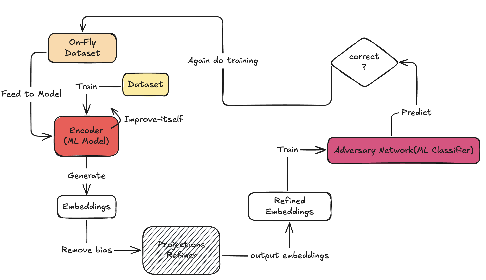

# VIBE (Variational Information Bottleneck for Embedding)

VIBE is a machine learning framework designed to remove unwanted biases from text embeddings while preserving useful information for downstream tasks. It uses adversarial learning and dimensionality reduction techniques to achieve fair representations.

## Overview

VIBE helps create fairer ML models by:
- Removing unwanted biases from input embeddings
- Preserving task-relevant information
- Supporting binary classification tasks
- Working with any text-based dataset

## Features

- **Automated Debiasing**: Automatically detects and removes bias from embeddings
- **Flexible Architecture**: Works with various types of text embeddings
- **Easy Integration**: Simple API for integration with existing ML pipelines
- **Performance Metrics**: Built-in evaluation of debiasing effectiveness
- **GPU Support**: Automatic GPU acceleration when available

## Quick Start

```python
from vibe import VIBE

# Initialize VIBE with your dataset
model = VIBE(
    input_col='text',           # Column containing text data
    output_col='label',         # Column containing binary labels
    dataPath='your_data.csv',   # Path to your CSV dataset
    hidden_layer_sizes=[512, 256],  # Architecture configuration
    enable_debiasing=True       # Enable bias removal
)

# Train the model
model.run()

# Get debiased embeddings
debiased_embeddings = model.fetch_debiased_embeddings()
```

## Requirements

- Python 3.8+
- PyTorch
- sentence-transformers
- scikit-learn
- pandas
- numpy

## High Level Architecture


## Usage Examples

VIBE can be used for various applications:
- Removing gender bias from text embeddings
- Debiasing sentiment analysis models
- Creating fair classification systems
- Reducing demographic biases in ML models

## Performance

The framework provides several metrics to measure debiasing effectiveness:
- Correlation reduction between protected attributes and embeddings
- Prediction disparity measurements across groups
- Classification accuracy preservation
